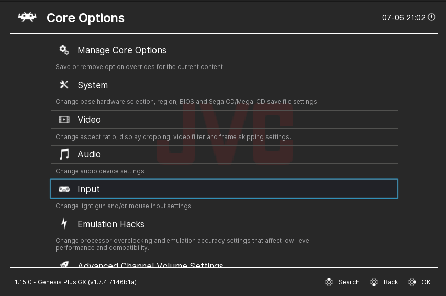

## Core options

In Retroarch each core has own configuration options.

Check example in Retroarch

<p align="center">
  <picture></picture>
  
</p>

All these core options just config files that placed in desktop retroarch installation folder.

```
/retroarch-folder/.config/retroarch/config/
 |
 -- FCEUmm
 |  |
 |  -- FCEUMM.opt
 |
 -- Genesis Plus GX
 |  |
 |  -- Genesis Plus GX.opt
 ....
```

We can explore this files and change some settings and copy them to our web retroarch instance.

We need two things

- pack of options
- folder name of core options config

Let's change some core options!

### Default core options in repository

Compiled cores in [`cores`](/cores/) folder already has default config that contains default options and folder name.

```
${core}.options.js
```

No need do nothing, those settings will load automatically.

Also, url of options can be changed

```js
const retroarch = await createRetroarch({
  //....
  optionsUrl: `https://publicFolder/cores/${core}.options.js`,
  //....
})
```

### Change settings in Retroarch instance

```js
retroarch.copyOptions({ ...defaultOptions, fceumm_turbo_delay: "5" }, "FCEUmm")
```
